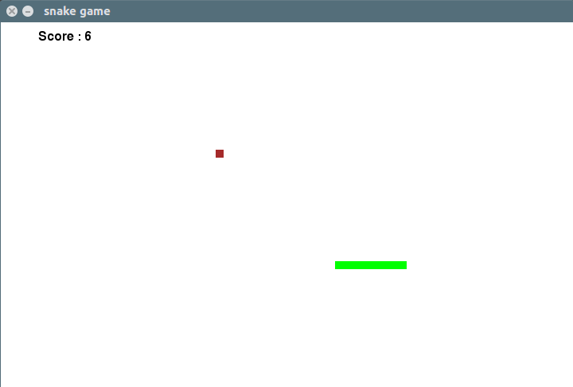
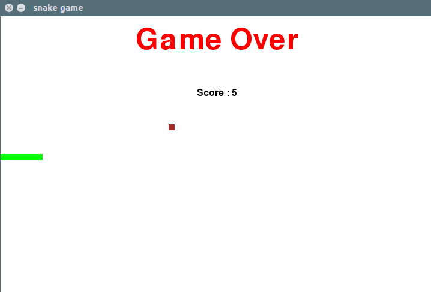
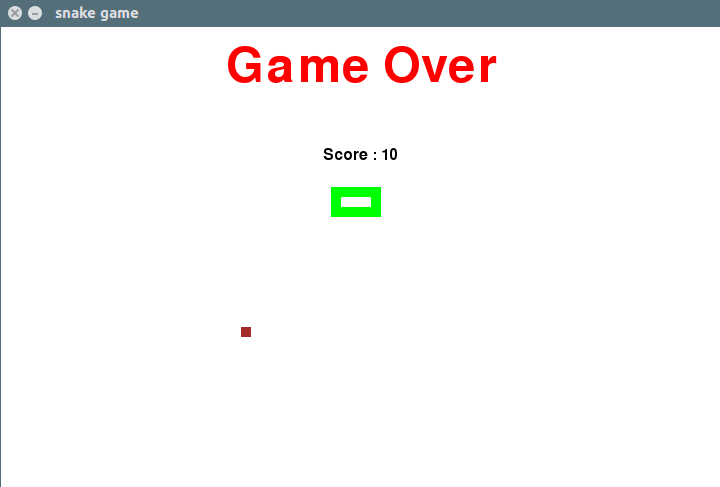

# snake-game
Made this game in my free time using python. 

### How to run
* Install [Python 3](https://www.python.org/downloads/)
* Install [pip](https://pip.pypa.io/en/stable/installing/) for Python 3
* Clone this repository to by running `git clone https://github.com/Tusharmalik/snake-game.git`
* Open Terminal and get inside the repository folder by running `cd snake-game`
* Install pipenv by running `pip install pipenv`
* To install all other requirements simply run `pipenv install -r requirements.txt`
* Run the program by `pipenv run python game.py`

### reference

* [pygame](https://www.pygame.org/news)
* [youtube](https://www.youtube.com/watch?v=rbasThWVb-c)
